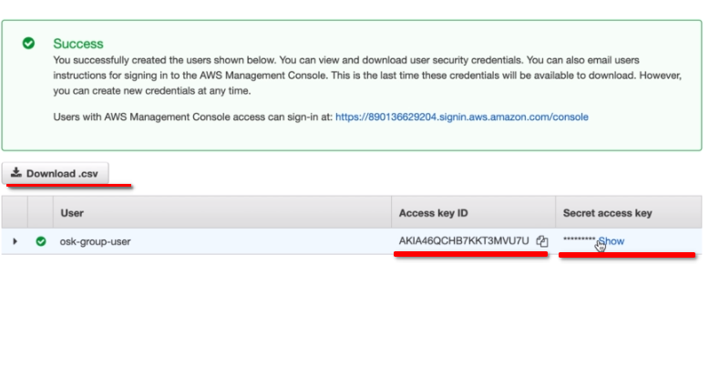
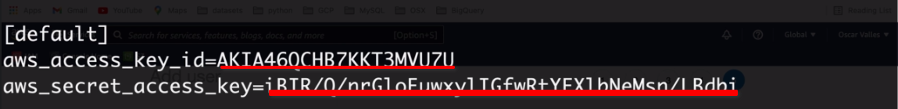

# AWS S3 with Python course

### Index
- [AWS S3 with Python course](#aws-s3-with-python-course)
    - [Index](#index)
    - [About](#about)
    - [How to set requirements](#how-to-set-requirements)
        - [GNU/Linux Ubuntu and derivates](#gnulinux-ubuntu-and-derivates)
        - [Windows](#windows)
    - [Download the project](#download-the-project)
    - [Set enviroment and get ready](#set-enviroment-and-get-ready)
        - [GNU\\linux set](#gnulinux-set)
        - [Windows set](#windows-set)
        - [both OS](#both-os)
        - [Last steps](#last-steps)
    - [Run and having fun](#run-and-having-fun)

--- 
### About
This project is based on the project of the free Udemy course [Using AWS S3 with Python](https://www.udemy.com/course/using-aws-s3-with-python/learn/lecture/30459384#overview), That's an introductory course about how to use Python to handle AWS S3 funtionalities.

The .csv files used as sample data in this project were download from the following sources
   * [AppsLoveWorlds](https://www.appsloveworld.com/sample-csv-file)
   * [Stats NZ](https://www.stats.govt.nz/large-datasets/csv-files-for-download/)
   * [Free Test Data](https://freetestdata.com/other-files/csv/#google_vignette)
   * [Sample Videos](https://sample-videos.com/download-sample-csv.php)


### How to set requirements

##### GNU/Linux Ubuntu and derivates
```bash
$ sudo apt install python3 python3-dev python3-pip python3-wheel python3-setuptools python3-venv python-is-python3 git
```
##### Windows
Install [Python3 64bit](https://www.python.org/ftp/python/3.8.7/python-3.8.7-amd64.exe) or [Python3 32bit](https://www.python.org/ftp/python/3.8.7/python-3.8.7.exe) then configure so that [python appears in the Windows PATH](https://datatofish.com/add-python-to-windows-path/).
Install git for windows [64bit](https://github.com/git-for-windows/git/releases/download/v2.30.0.windows.2/Git-2.30.0.2-64-bit.exe) or [32bit](https://github.com/git-for-windows/git/releases/download/v2.30.0.windows.2/Git-2.30.0.2-32-bit.exe) to clone the Github repository.

### Download the project
This repo can be accessed on [Github](https://github.com/ReynaldoCC/), then can be downloaded as .zip file or cloned using the git command

```bash
   git clone https://github.com/ReynaldoCC
```

### Set enviroment and get ready

First need to create an user in AWS IAM with the right(full in this case) privileges over AWS S3, after create the user is able to take the user credentials fromn the last screen, downloading the credentials as .csv or copying directly from the web


##### GNU\linux set

In GNU\Linux we need to create if not exists the directory named *'.aws'* in the home dictory of the user, inside the folder *'.aws'* we create the file named *'credentials'* if not exists, if exists we should create a back up of the file before editing the file, after that edit the file to add the credential's data. For this purpose we can use the follow commands
```bash
   cd
   [ -d .aws ] || mkdir .aws
   [ ! -f doo/file ] && ( touch .aws/credentials ) || ( cp .aws/credentials .aws/credentials.bkp )
   vim .aws/credentials
```

##### Windows set

When use Windows the AWS credentials are saved in the user root folder following the same estructure as GNU\Linux and MAC. Then the file which need to be created or updated is located in <code>C:\Users\USERNAME\\.aws\credentials</code> . Inside that file should added the credential's data.

##### both OS
The content of the file must be the same or very similar in both OS, and should looks like this

Of course using your own real credentials.

##### Last steps 
   - Move to the project directory
```bash
   cd <Project Root>
```

   - Create Python virtual environment and activate it.
  **Note:** This step is not mandatory but nighly recomended
```bash
   python -m venv esthree_env
   source esthree_env/bin/activate
```
  **Note:** Activation in windows is made running a .bat script
```bash
   esthree_env/bin/activate.bat
```
   - Install python requerimetns
```bash
   pip install -r requirements.txt
```

### Run and having fun

Now we can run the project python scripts and try the functionalities of AWS S3 from our python code, let's enjoy